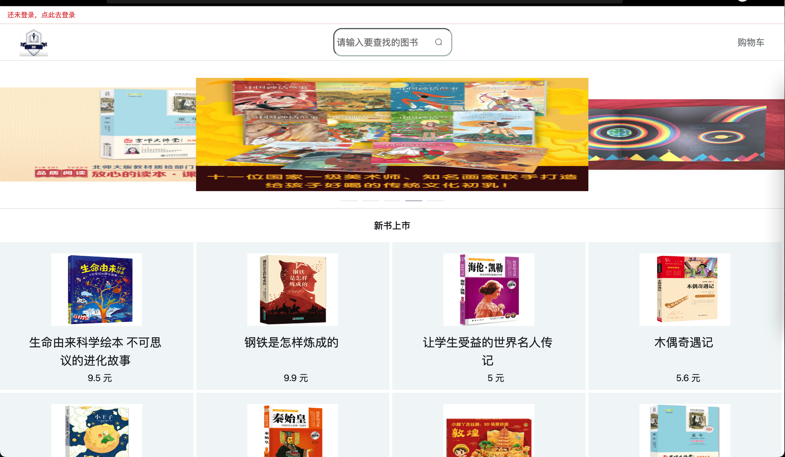

# store
## 基于vue和element-ui框架
## 基本页面
- 首页
  - 顶部shortCar退出登录按钮的动态显示
    - 查看是否为登录状态
      - 是 ->
        - 隐藏登录/注册入口，显示个人中心
      - 否 -> 
        - 显示登陆界面 
  - 响应式
  - 手机电脑平板三端适应
  - 
  - 
  - 
- 详情页
  - 动态展示所点图书数据
  - 添加图书到购物车
- 登录注册页
  - 登录
  - 注册
- 购物车
  - 判断是否登录
    - 是 -> 
      - 登录后获取数据库用户购物车内容并与本地用户购物车内容合并显示
    - 否 -> 
      - 跳转到登录页面提示登录
  - 结算提交购物车内容到数据库（未实现）
- 个人中心
  - 
## Project setup
```
npm install
```

### Compiles and hot-reloads for development
```
npm run serve
```

### Compiles and minifies for production
```
npm run build
```

### Lints and fixes files
```
npm run lint
```

### Customize configuration
See [Configuration Reference](https://cli.vuejs.org/config/).
